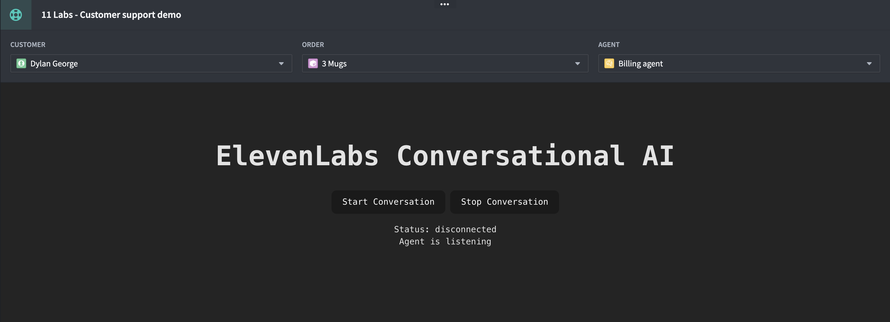
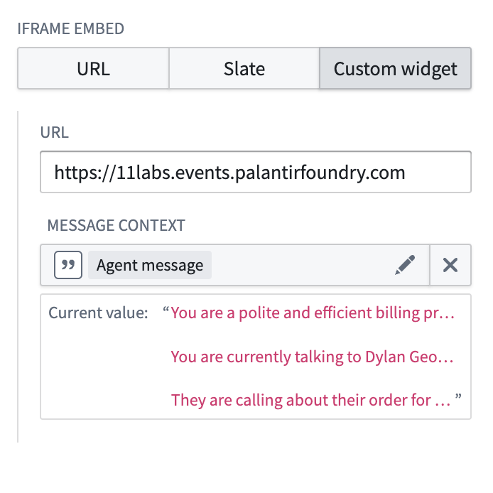
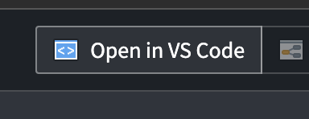

# Eleven Labs Conversational AI Agent



This workshop widget showcases how to use elevenlabs.io's react SDK from within workshop [docs](https://elevenlabs.io/docs/conversational-ai/libraries/react). This widget uses palantir's [iframe custom widget](https://github.com/palantir/workshop-iframe-custom-widget) library to communicate with the parent workshop page allowing the conversational AI to use your ontology's data for context and actions.



This widget uses Palantir's [iframe custom widget](https://github.com/palantir/workshop-iframe-custom-widget) library, which is licensed under a proprietary Palantir license. Please visit https://github.com/palantir/workshop-iframe-custom-widget to view the license.

## Upload Package to Your Enrollment

The first step is uploading your package to the Foundry Marketplace:

1. Download the project's `11labs_store.mkt.zip` file from this repository
2. Access your enrollment's marketplace at:
   ```
   {enrollment-url}/workspace/marketplace
   ```
3. In the marketplace interface, initiate the upload process:
   - Select or create a store in your preferred project folder
   - Click the "Upload to Store" button
   - Select your downloaded `.zip` file


## Install the Package

After upload, you'll need to install the package in your environment. For detailed instructions, see the [official Palantir documentation](https://www.palantir.com/docs/foundry/marketplace/install-product).

The installation process has four main stages:

1. **General Setup**

   - Configure package name
   - Select installation location

2. **Input Configuration**

   - Configure any required inputs. If no inputs are needed, proceed to next step
   - Check project documentation for specific input requirements

3. **Content Review**

   - Review resources to be installed such as Developer Console, the Ontology, and Functions

4. **Validation**
   - System checks for any configuration errors
   - Resolve any flagged issues
   - Initiate installation

## Configuring the OSDK React App

Launch the `11 labs React App` repository installed from this marketplace product. Now, open this repository in VSCode, allowing for react app preview and development in Foundry's _Code Workspaces_.



Alternitavely, Follow the steps in [Installation.md](./../INSTALLATION.md) under `SDK Configuration (Optional)` to develop locally with the `react-app-widget`
