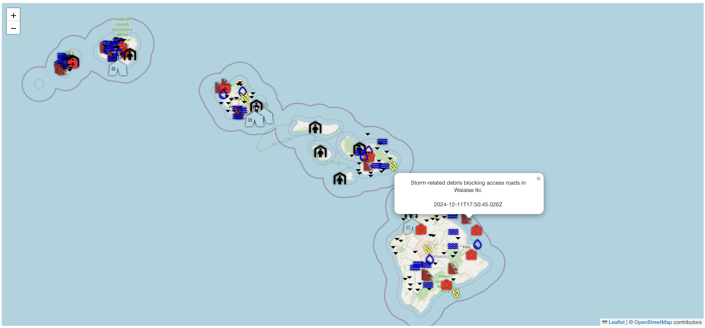
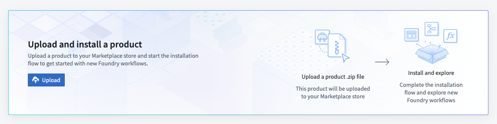
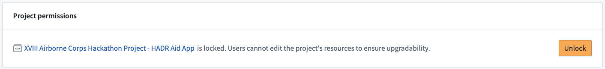
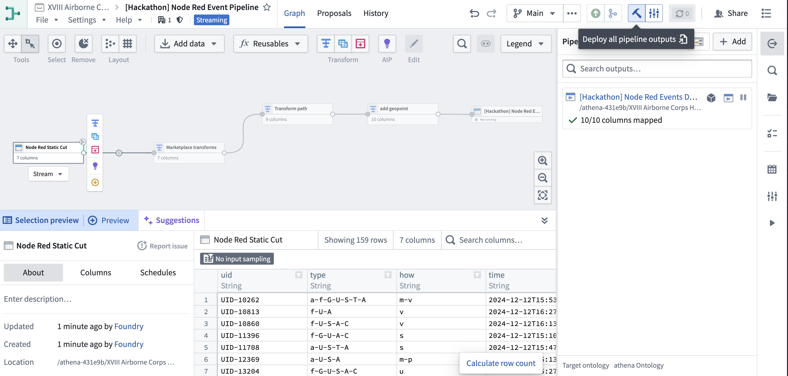
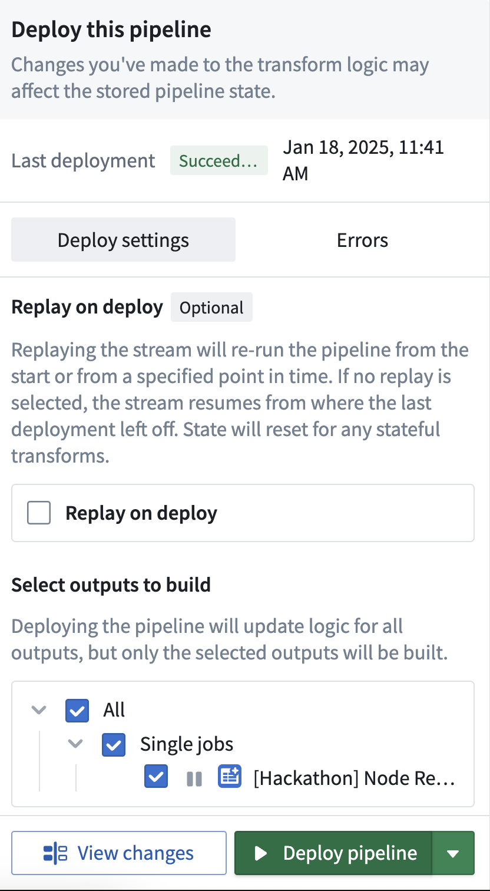
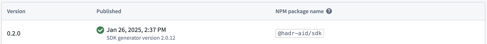

# ASWF 2024 Hackathon - HADR Aid


The Army Software Factory, U.S. Army Futures Command was the host for their first ever 40 + hour Hackathon. The Hackathon included teams comprised of both Soldiers and Department of the Army Civilians from across the Department of Defense highlighting their ability to create and facilitate technology solutions in a rapid response scenario - wherein a fictional typhoon impacted Hawaii. The event took place December 10th-13th, 2024, Austin Community College, Austin, Texas.

CPT Elliott Hamilton, Software Developer and team built an OSDK React application in Code Workspaces, making use of Leaflet to plot medical and relief reports, shelter / emergency hub availability, environmental reports, and task force location and response data - all to help them gain rapid situational awareness on how to best move resources to aid impacted civilians.



## Upload Package to Your Enrollment

The first step is uploading your package to the Foundry Marketplace:

1. Download the project's `.zip` file from this repository
2. Access your enrollment's marketplace at:
   ```
   {enrollment-url}/workspace/marketplace
   ```
3. In the marketplace interface, initiate the upload process:
   - Select or create a store in your preferred project folder
   - Click the "Upload to Store" button
   - Select your downloaded `.zip` file



## Install the Package

After upload, you'll need to install the package in your environment. For detailed instructions, see the [official Palantir documentation](https://www.palantir.com/docs/foundry/marketplace/install-product).

The installation process has four main stages:

1. **General Setup**
   - Configure package name
   - Select installation location

2. **Input Configuration**
   - Configure any required inputs. If no inputs are needed, proceed to next step
   - Check project documentation for specific input requirements

3. **Content Review**
   - Review resources to be installed such as Developer Console, the Ontology, and Functions

4. **Validation**
   - System checks for any configuration errors
   - Resolve any flagged issues
   - Initiate installation


Additionally, this product includes a Pipeline to transform a a raw stream into a dataset to back the `[Hackathon] Node Red Event` object.  For this Marketplace product, we have replaced the raw stream with a static cut dataset.  The Marketplace product will be installed in a "locked" state to avoid edits to the installation.  To ensure this Pipeline runs and hydrates the `[Hackathon] Node Red Event` object, you will need to "unlock" the Marketplace installation then run the Pipeline:

5. **Unlock the Marketplace Installation**
   - Navigate to the "Settings" tab of the Marketplace installation
   - Scroll to the bottom to see the "Project Permissions" section and click the "Unlock" button
   - Confirm the action to "Unlock" the installation
      
<br>

6. **Run the Pipeline to Hydrate the `[Hackathon] Node Red Event` Object**
   - Navigate to the "Contents" tab of the Marketplace installation and select "Pipelines"
   - Click the link to open the `[Hackathon] Node Red Event Pipeline` link
   - Click the hammer icon on the top right to build the pipeline
   - Click again to deploy the pipeline in the "Deploy this pipeline" panel that pops up
      | Build | Deploy    |
      | ------ | ------   |
      |  |  |
   - After a few minutes your installed ontology should be hydrated!  Specifically, you should see 159 objects for the `[Hackathon] Node Red Event` object type
<br>


## SDK Configuration

This package includes an OSDK React application.  

1. **Locate the SDK application code** in the `HADR-Aid-Code-Repository/` directory of this project repository
<br>

2. **Note configuration details**
   - Navigate to Developer Console: `{enrollment-url}/workspace/developer-console`
   - Find the installed application - "HADR Aid"
   - Copy the following details:
     - CLIENT ID
     - Enrollment URL `{enrollment-url}`
<br> 

3. **Configure your development environment**
   - Edit the `.env.code-workspaces`, `.env.development`, and `.env.production` to set the Foundry API URL and the Foundry CLIENT ID that you copied in the previous step
      - Try using `npm run setup` and follow the instructions to populate everything you need to start developing locally.
      - To run locally, the `.env.development` configuration is needed and you will need to set the redirect URL to localhost:
      <br>

      ```
      VITE_FOUNDRY_API_URL=<enrollment-url>
      VITE_FOUNDRY_REDIRECT_URL=http://localhost:8080/auth/callback
      VITE_FOUNDRY_CLIENT_ID=<client-id>
      ```


## Run the Application
1. **Install dependencies**
   - Navigate back to the "HADR Aid" Developer Console Application
   - Select the "SDK versions" tab and click "Generate New Version," ensuring `npm` is selected
   - Note the generated SDK version and update the `HADR-Aid-Code-Repository/package.json` file to ensure the version for `@hadr-aid/sdk` (under "dependencies") matches the newly generated SDK version
   <br>

      

      <br>

      &rarr; `"@hadr-aid/sdk": "^0.2.0",`

   <br>
   
   - Select the "Start Developing" tab and select the "Add the Ontology SDK to an existing project" option
   - Follow the Prerequisite steps to configure your Foundry token and check your Node version
   - Follow the steps to "Set up the NPM registry" which includes populating an `.npmrc` file in the `HADR-Aid-Code-Repository/` directory
   - Run `npm install` from the root of the `HADR-Aid-Code-Repository/` directory
<br>

2. **Configure CORS**
   - Configure CORS in your control panel to allow `http://localhost:8080` - see [official Palantir documentation](https://www.palantir.com/docs/foundry/administration/configure-cors) for more details
<br>

3. **Run the application**
   - Run `npm run dev` from the root of the `HADR-Aid-Code-Repository/` directory
   - Navigate to http://localhost:8080 to access the application

<br>

### (Optional) Deploy the application
Check out the "Deploying applications" of the `HADR Aid` Developer Console application to explore different deployment options