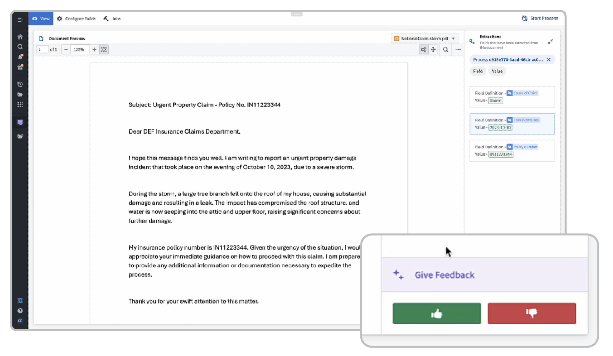
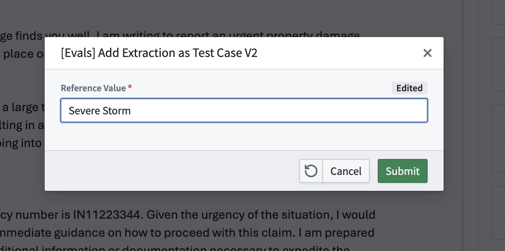
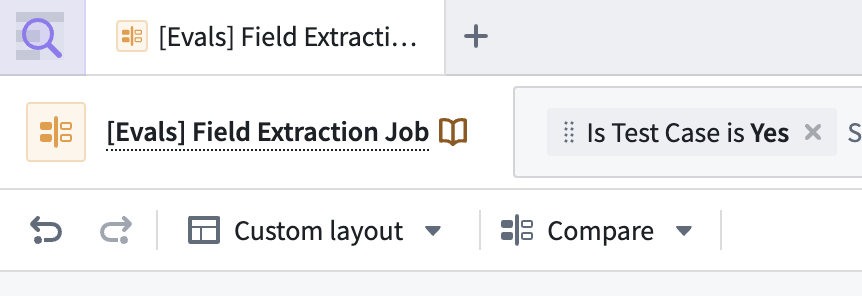
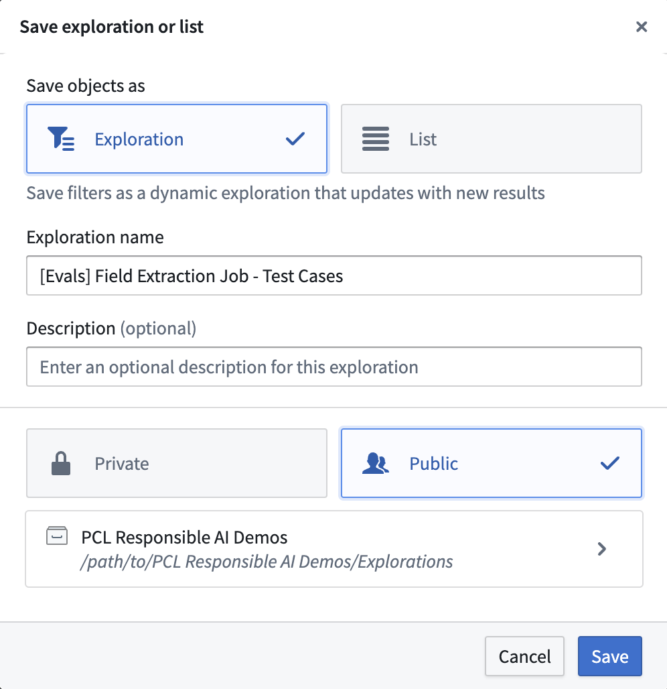
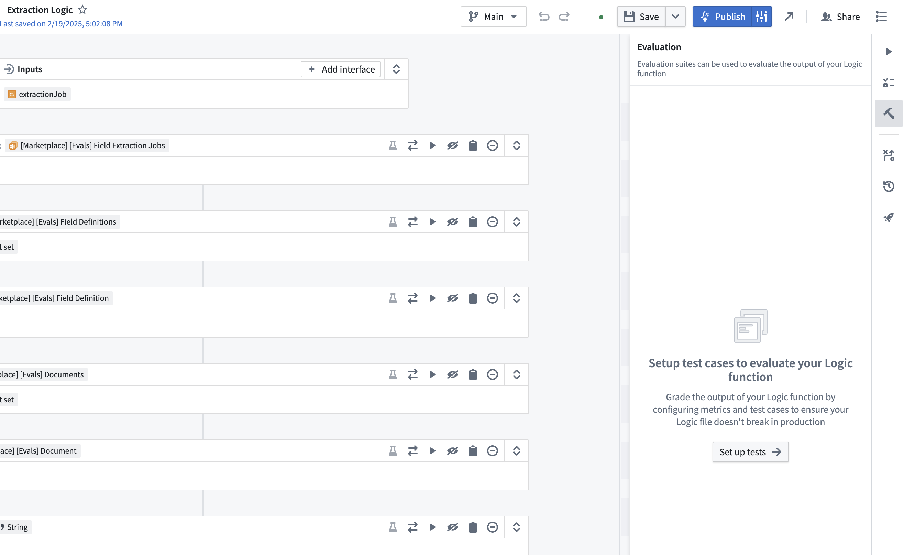
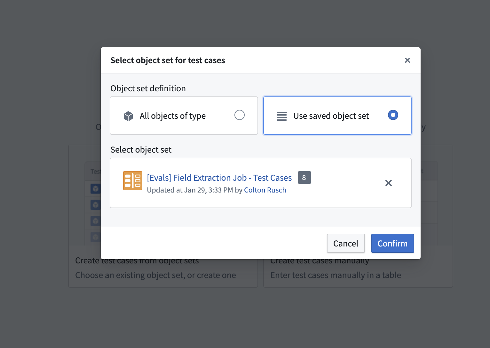
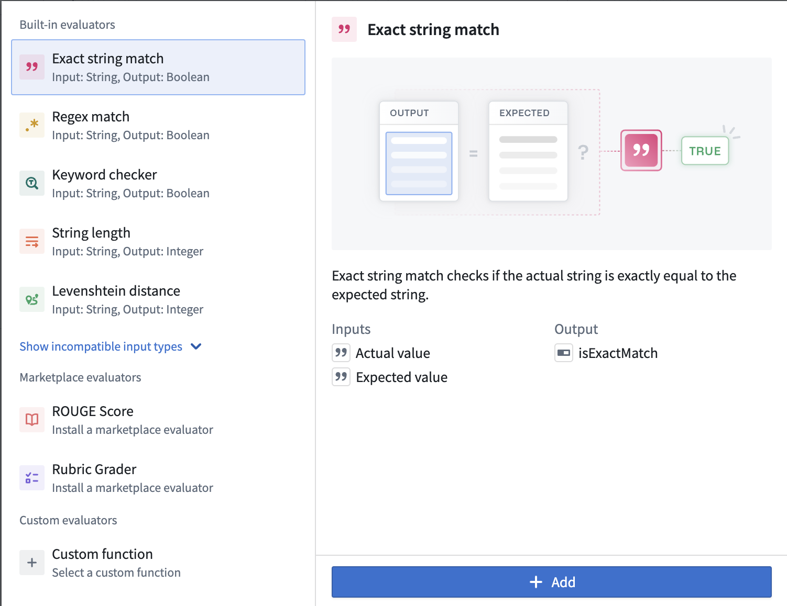
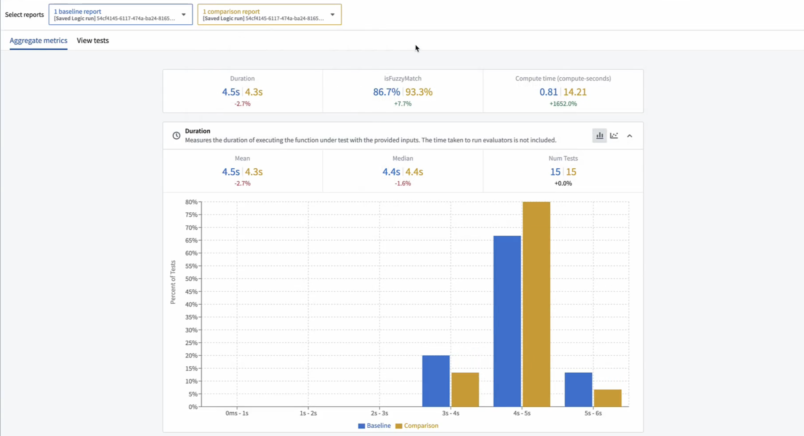

# Feedback Loop with AIP Evals




## About

This is a demo of how you can set up a feedback loop where end-users can flag AIP outputs, capturing their feedback in the Ontology and allowing you to leverage that feedback in your AI development cycle by integrating it dynamically into AIP Evals.

The main Workshop application is comprised of an entity extraction workflow where an LLM is extracting key details from insurance claims documents. Users can click on these AI extracted fields to give feedback. You can then pull this into your AIP Evals evaluation suite for the Logic function!

## Upload Package to Your Enrollment

The first step is uploading your package to the Foundry Marketplace:

1. Download the project's `.zip` file from this repository
2. Access your enrollment's marketplace at:
   ```
   {enrollment-url}/workspace/marketplace
   ```
3. In the marketplace interface, initiate the upload process:
   - Select or create a store in your preferred project folder
   - Click the "Upload to Store" button
   - Select your downloaded `.zip` file


## Install the Package

After upload, you'll need to install the package in your environment. For detailed instructions, see the [official Palantir documentation](https://www.palantir.com/docs/foundry/marketplace/install-product).

The installation process has four main stages:

1. **General Setup**
   - Configure package name
   - Select installation location

2. **Input Configuration**
   - Configure any required inputs. If no inputs are needed, proceed to next step
   - Check project documentation for specific input requirements

3. **Content Review**
   - Review resources to be installed such as the Ontology and Functions

4. **Validation**
   - System checks for any configuration errors
   - Resolve any flagged issues
   - Initiate installation

## Run the Claims Parsing Process


Then, once the product content has installed, choose a document in the Workshop and click "Start Process" in the top right. Choose the pre-built "Claims Parsing" process, and wait for AI agents to process the document.

## Provide Feedback on Extracted Values


Once extractions have been completed, give some feedback on the extracted values — click on an AI extracted field and give a thumbs up/thumbs down. If you flag something as thumbs down, enter the "actual"/"expected" value for that extraction.



## Create Test Cases in Object Explorer



Go to Object explorer and filter the "Field Extraction Job" object down to instances that have been flagged as test cases ("Is Test Case" = true/Yes). Save the Object set as an Exploration with Public permissions.



## Set up an AIP Evals Evaluation Suite



Then, go to the AIP Logic function that backs this workflow (it's installed in the "logic" folder). Create an AIP Evals evaluation suite via the right hand sidebar, and choose to populate the suite with an Object set. Choose the saved Object set that you've just created, and you'll see the feedback automatically pulled into AIP Evals as test cases!



## Configure the Evaluation Function

From there, set up an Evaluation function — to actually measure accuracy on these test cases, we must add evaluators. For quick/early calibration, something like the built-in "Exact string match" evaluator works fine, but it can be too strict. If the LLM paraphrases, we'll get false failures. Switching to the built-in "Keyword checker" often helps, or you can also build a custom evaluator — maybe powered by another LLM or a specialized fuzzy-matching function — to handle variations more intelligently.



## Run the Evaluation Suite

Finally, run the evaluation suite. AIP Evals orchestrates each test, logs pass/fail results, and tallies metrics in a dashboard. If the results aren’t where you'd like them, you can revise your logic by changing the prompt, adding more context via the Ontology, or switching models. Because new feedback from the thumbs-down button automatically updates our reference values, you're never outdated on test data or user expectations. This continuous loop ensures that the extraction workflow is always learning from real-world cases — limiting the amount of manual test maintenance required.



## Conclusion
That’s the entire flow: LLM extraction, user feedback, dynamic test case creation, and iterative evaluation. With AIP Evals, you can confidently tweak prompts, models, and logic, knowing you’ll see immediate, data-backed validation of any improvements or regressions.

For more AIP Evals resources see our docs + blog posts, and community forum guides:
- General product guidance: [AIP Evals Documentation](https://www.palantir.com/docs/foundry/logic/evaluations-overview/)
- Blog w/ intro to AIP Evals + basic example: [From Prototype to Production: Testing and Evaluating AI Systems with AIP Evals](https://blog.palantir.com/from-prototype-to-production-engineering-responsible-ai-3-ea18818cd222)
- Blog on the tradecraft of AI evals: [Evaluating Generative AI: A Field Manual](https://blog.palantir.com/evaluating-generative-ai-a-field-manual-0cdaf574a9e1)
- Community Forum - best practices and learnings from Palantir engineers: [[Guide] Writing Effective Evals](https://community.palantir.com/t/guide-writing-effective-evals/2856)
- Community Forum - worksheet to develop an evals plan: [[Worksheet] Evals Field Manual](https://community.palantir.com/t/worksheet-evals-field-manual/2855)
