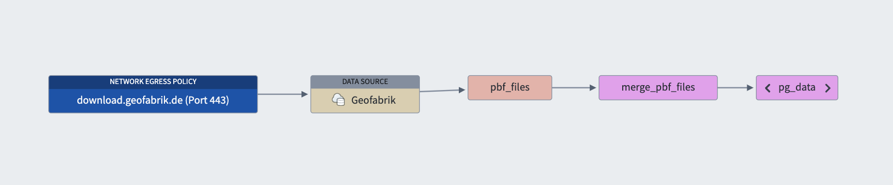
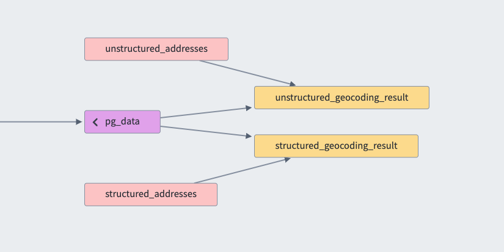
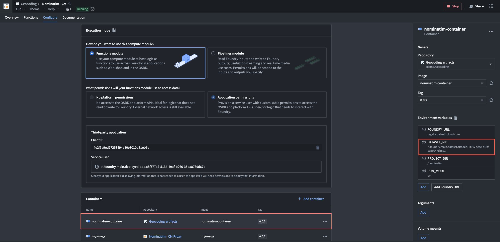
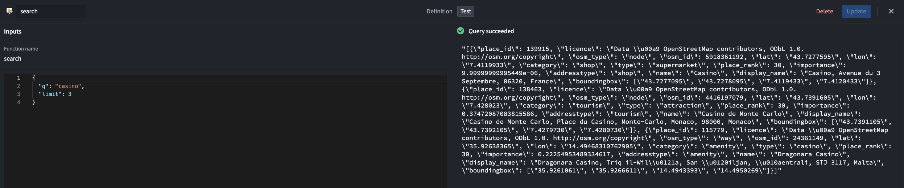
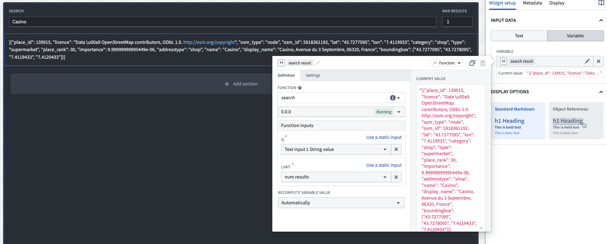

# Geocoding with Nominatim

## Introduction

This is a simple geocoding service that uses the Nominatim API to convert addresses into geographic coordinates. This project allows you to do both forward and reverse geocoding on a subset or the entirety of the planet.

It supports both real-time processing through a [compute module](https://www.palantir.com/docs/foundry/compute-modules/overview) as well as high scale batch processing through [Foundry spark sidecar transforms](https://www.palantir.com/docs/foundry/transforms-python/transforms-sidecar)

All geocoding is done using [nominatim](https://nominatim.org/) which is a free and open-source geocoding service that is based on publicly available [OpenStreetMap data](https://www.openstreetmap.org/about). You can find more information about how nominatim works [here](https://nominatim.org/release-docs/latest/).

## Overview

Nominatim traditionally takes a very long time to startup as it requires extracting a large osm file and hydrating a postgres database. 

This project gets around this by creating the database in an asynchronous background transform allowing the runtime (compute module or spark sidecar) to start up quickly by pulling the latest postgres dump from a shared dataset.

The pipeline looks like this:



1. We download the `pbf_files` of the requested areas from geofabrik
2. We merge the dumps into a single `merged_pbf_file` using a lightweight bring-your-own-container (BYOC) transform
3. We hydrate nominatim's postgres database using the merged dump and dump the database to a `pg_data` dataset

### Transform sidecar

When running the geocoding as a spark sidecar transform, the pipeline looks like this:



1. We take as input both the data containing the addresses to geocode and the `pg_data` dataset
2. We add the `geocoding` library which ships with the marketplace bundle to our code repository
3. We annotate our transform with the `@nominatim_transform` annotation from the `geocoding` library. It handles telling foundry to start the nominatim container as a sidecar
4. We call the the `geocoding` library's `create_geocoder_udf` function to create a spark UDF that can be used to geocode addresses using the provided parameters


```
geocoded_locations = (
    locations.repartition(16)
    .withColumn(
        "geocoded",
        create_geocoder_udf(
            geocoder_files.filesystem(),
            limit=1,
            addressdetails=True,
            namedetails=True,
            extratags=True,
            max_backoff=5
        )(
            locations=F.struct(
                F.col("street"),
                F.col("city"),
                F.col("county"),
                F.col("state"),
                F.col("country")
            ),
            # if unstructured just pass the address to locations. locations=F.col("unstructured_address")
            # viewboxes=F.array(F.lit("-90,-180"), F.lit("90,180")),
            # languages=F.lit("en")
        ),
    )
    .withColumn("geocoded", F.col("geocoded").getItem(0))
)
```

### Compute module

When running the geocoding as a compute module, marketplace will automatically create the compute module for us. We just need to ensure the environment variable `DATASET_RID` on the `nominatim-container` is pointing to the `pg_data` dataset that we just created.



> [!TIP]
> Compute modules don't allow communicating with the outside through regular http requests, they use a polling mechanism. To allow external services like nominatim to communicate with foundry I recommend creating a lightweight proxy container that translates between the two.
> You can find the code for the proxy container [here](./code/compute-module/proxy/app.py)

You can preview the compute module in the functions view.



And use the functions in your workshops or actions!




## Marketplace

### Contents

- **Geocoding Data Processing**: Code repository with the data processing logic
- **geocoding sidecar library**: Code repository with the spark sidecar library. You should import this library in your code repository to use the geocoding functionality
- **Nominatim - CM**: Compute module that runs the nominatim container
- **Geocoding artifacts**: Docker containers used by the compute module, geocoding data processing and the spark sidecar library
- **Nominatim - CM Proxy**: Compute module code for the proxy container'
- **Datasets**: Folder containing the datasets used by the geocoding pipeline

Marketplace file: (Coming soon). In the meantime you can find most of the code in the [code](./code) folder or contact your Palantir representative.