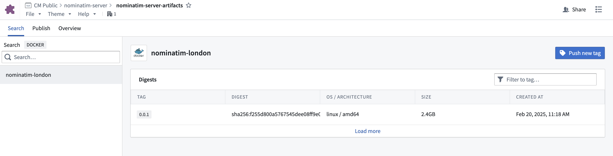
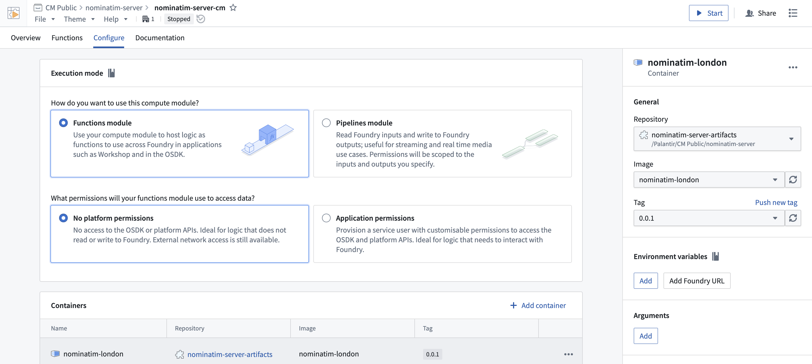
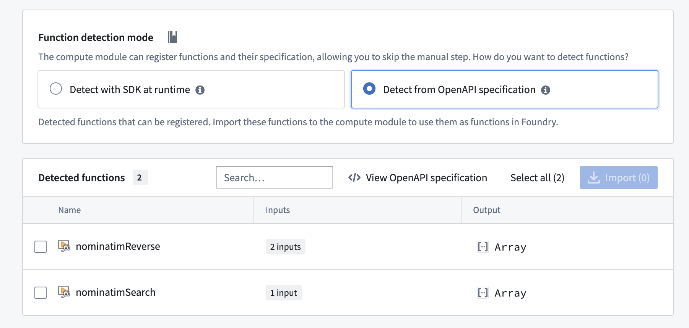
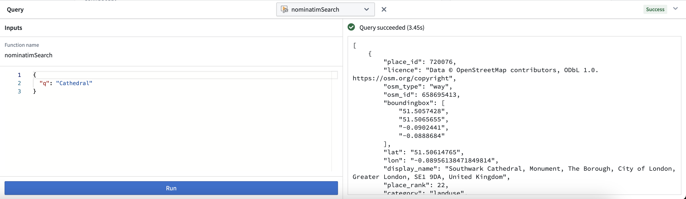

# Compute Module Geocoding Server

## Introduction
This is an example of integrating a server into a compute module. By attaching an OpenAPI specification in your Docker image labels, you can use an existing server without any special adapter code or conversion logic, and have your endpoints automatically parsed into ready-to-use Functions. 

We are running a [Nominatim](https://nominatim.org/) server, which is an open-source project for geocoding based on publicly available [OpenStreetMap](https://www.openstreetmap.org/about) data. This server is hosting the `/search` and `reverse` endpoints from Nominatim 3.7.2. `/search` allows you to enter a query string (eg. "Buckingham Palace") and get back information such as latitude and longitude, while `reverse` allows you to enter a latitude and longitude and get back information such as the street address. You can find more documentation on these endpoints [here](https://nominatim.org/release-docs/3.7/api/Overview/).

## Building Your Image

First, navigate to the `/code` directory. The `Dockerfile` contains all necessary instructions to build a Docker image which will run the Nominatim server. Note the `LABEL server.openapi` line, which is where we specify the endpoints our server is hosting so that we can seamlessly integrate it into Foundry.

To build the image, you first need data for your Nominatim server to use. OpenStreetMap data can be downloaded through [Geofabrik](https://download.geofabrik.de/). 

Next, create an Artifacts Repository in Foundry. Navigate to the `Publish` tab, and select `Docker` from the dropdown. Follow the provided command to build your Docker image, specifying the path to your data via the `OSM_DATA` build argument. For example:
```commandline
docker build --platform linux/amd64 -t example.palantirfoundry.com/nominatim-server:0.0.1 --build-arg OSM_DATA=./greater-london-latest.osm.pbf .
```

Next, use the provided command to publish your built image to your Artifacts Repository. Once complete, you'll see your uploaded image.



## Integrating in Compute Modules
Create a Compute Module in Foundry in the same project as your Artifacts Repository. Navigate to the `Configure` tab, then select `Add container` under the `Containers` section and choose your Artifacts Repository and published image.


Next, navigate to the `Functions` tab and select `Detect from OpenAPI specification` under `Function detection mode`. Functions will be automatically parsed from the OpenAPI specification in the image labels, ready to use throughout Foundry - no adapters or manual conversion necessary. Click `View OpenAPI specification` to view the full server specification and more details about the inputs and outputs.


Select the `nominatimReverse` and `nominatimSearch` functions and import them, then click `Start` on your compute module to deploy your server. Once the compute module has started, you can test your Functions through the `Query` bar on the `Overview` page, as well as use them throughout Foundry, such as in Workshop or AIP Logic.


