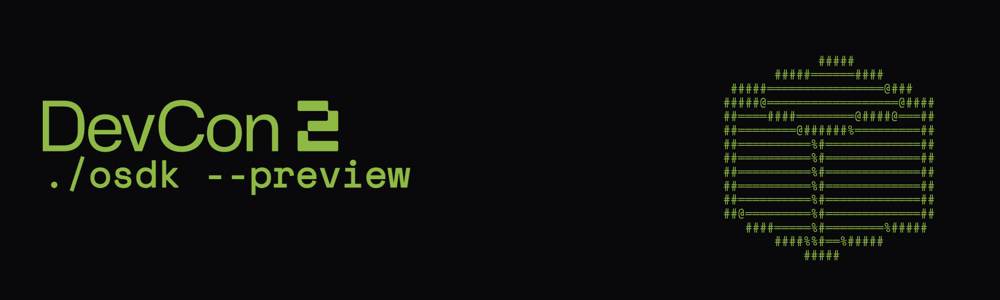
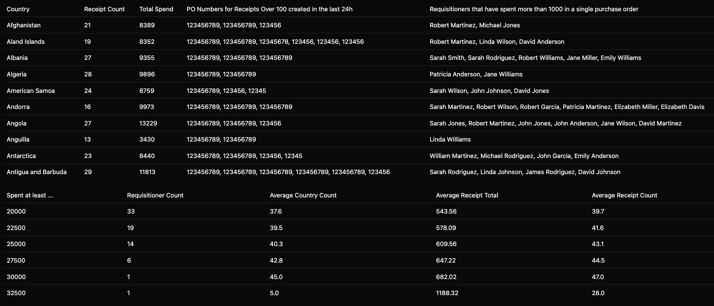
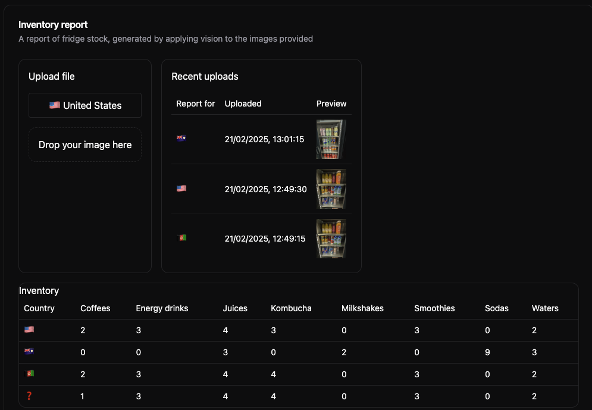

# OSDK with Media and Derived Properties Workshop



To get started with this product, install the product and open "ReceiptHellm App", you should be able to see the application in VSCode with a much more thorough README file.

### Derived properties walkthrough

Derived properties are properties that are calculated at runtime based on the values of other properties or links on objects. This includes aggregating on or selecting properties of linked objects. Derived properties are then available for further operations, such as filtering, or aggregating within the same request. As a beta feature, there are a few known limitations - see the docs for more information.



### MediaSet walkthrough

A media set is a collection of media files with a common schema, for example, files of the same format. You can read and write media to the platform by using OSDK in your repositories, allowing you to leverage features of AIP and Foundry in your multimodal workflows.



### Handling name clashes

If the ontology of this demo clashes with your existing objects, you may need to edit the code in the following files to correct the object imports:

- src/GlobalReportPage.tsx
- src/InventoryReportPage.tsx
- src/shared-components/CountryDropdown.tsx

## Upload Package to Your Enrollment

The first step is uploading your package to the Foundry Marketplace:

1. Download the project's `.zip` file from this repository
2. Access your enrollment's marketplace at:
   ```
   {enrollment-url}/workspace/marketplace
   ```
3. In the marketplace interface, initiate the upload process:
   - Select or create a store in your preferred project folder
   - Click the "Upload to Store" button
   - Select your downloaded `.zip` file


## Install the Package

After upload, you'll need to install the package in your environment. For detailed instructions, see the [official Palantir documentation](https://www.palantir.com/docs/foundry/marketplace/install-product).

The installation process has four main stages:

1. **General Setup**

   - Configure package name
   - Select installation location

2. **Input Configuration**

   - Configure any required inputs. If no inputs are needed, proceed to next step
   - Check project documentation for specific input requirements

3. **Content Review**

   - Review resources to be installed such as Developer Console, the Ontology, and Functions

4. **Validation**
   - System checks for any configuration errors
   - Resolve any flagged issues
   - Initiate installation
