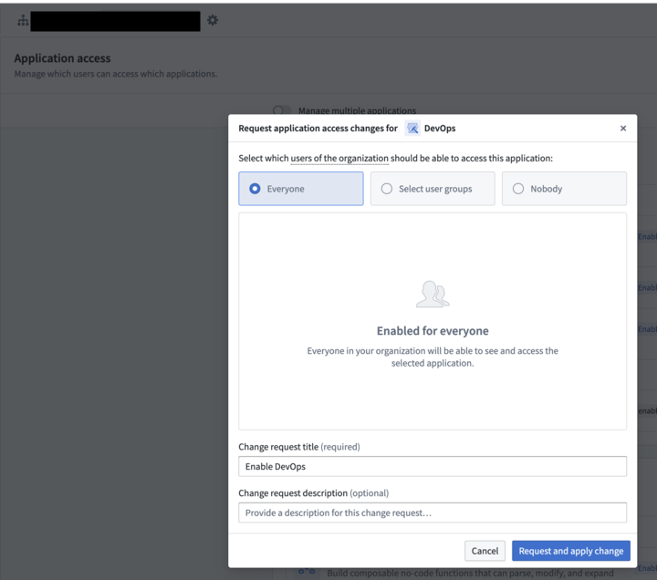
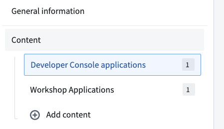
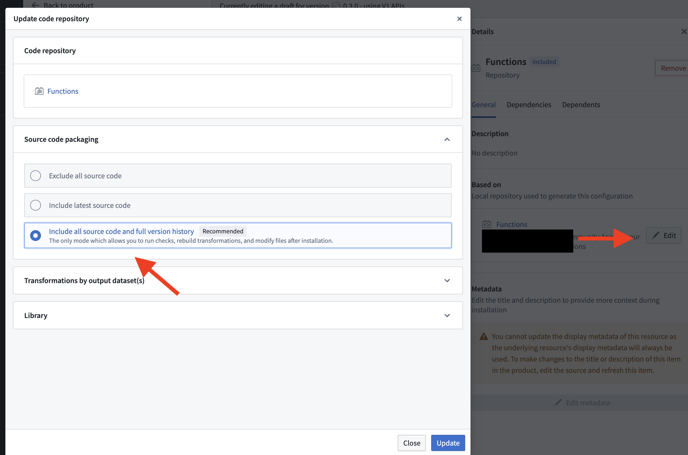
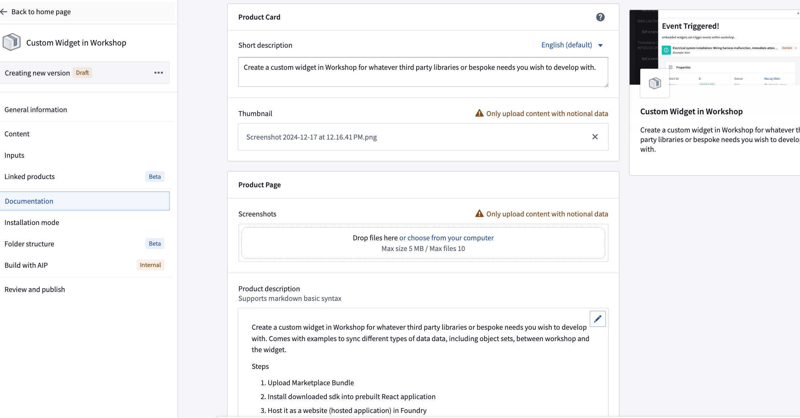
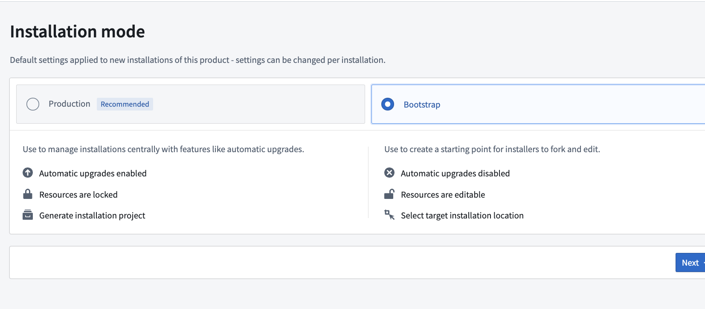
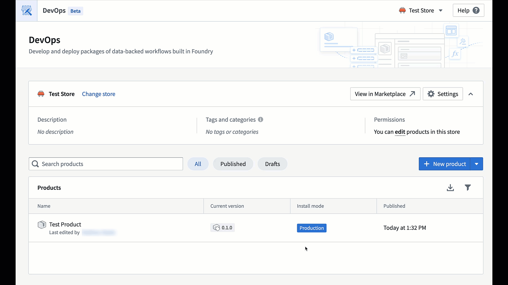

# Packaging your Contribution for Marketplace

Please find a guide below for how to package your application:

* Step 0: Starting Tips
* Step 1: Package using DevOps
* Step 2: Troubleshoot Common Errors
* Step 3: Polish and Publish!

## 0. Starting Tips for Packaging

* You may have to turn on DevOps in Control Panel and accept the change using Control Panel!
* We recommend creating your first DevOps package early on into your building process, then adding content as you further develop your application - this enables you to more quickly root cause any issues.
* When adding content to your package, add your developer console application, or main Workshop Module first, and then add the dependencies!

## 1. Packaging using DevOps

i. In your Foundry instance, navigate to DevOps /workspace/dev-ops/home. As in Step 0, You may need to enable DevOps in the Control Panel application first

ii. Create a new store for your package

iii. Name your product

iv. Under content, add your workflow.

v. Package up the objects, their backing datasets (see step vi. below), and all actions or functions used.
The only input’s that should be excluded are language models (e.g. GPT-4o) or parameters (e.g. auth callback in a developer console).

vi. Package up any initial data you wish to be shipped with the workflow by adding the backing datasets as content in DevOps.

*Please include the source code for any functions or transforms repository*

## Step 2: Troubleshoot Common Errors

i. If you are using groups or userids in the submission criteria for Actions, then change the submission criteria to be [user id is not no value]. 

ii. If you have data that is not present in the backing dataset (e.g. edit only objects), then materialize the objects edited dataset, and make a pipeline off of that materialized dataset.

iii. If you have sensitive data (e.g. multipass user ids or names), then use the pipeline to scrub that and replace the Objects backing dataset with the cleaned version and remove the materialization. Finally, add the dataset in DevOps.

iv. If you have a Mediaset & Mediareference Object property you want packaged, you’ll need to create a pipeline that runs the backing dataset upon installation, so that we can obtain the reference & media rids.

v. If you have an error that you cannot fix, ask [the Community](https://community.palantir.com/)!

## Step 3: Polish and Publish!

i. Under documentation, I add a screenshot of the workflow as the thumbnail, and use my product description for the readme as the documentation.

ii. Set to bootstrap mode

iii. Publish!

iv. Download your Zip file

