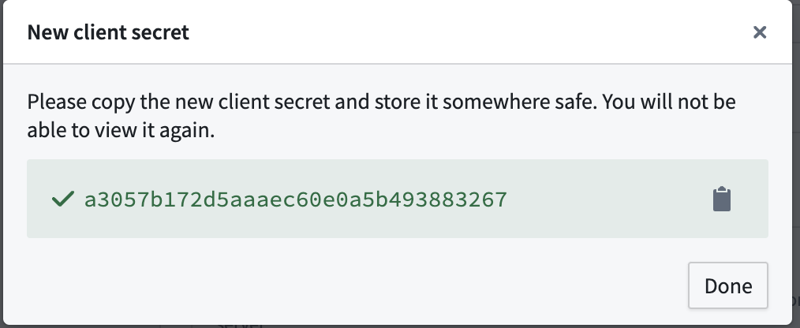
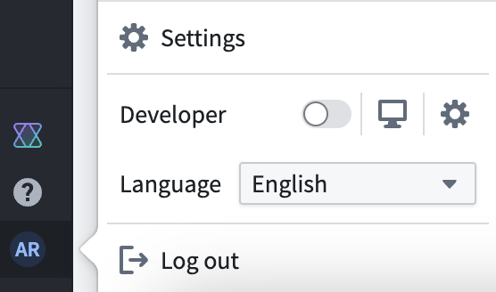
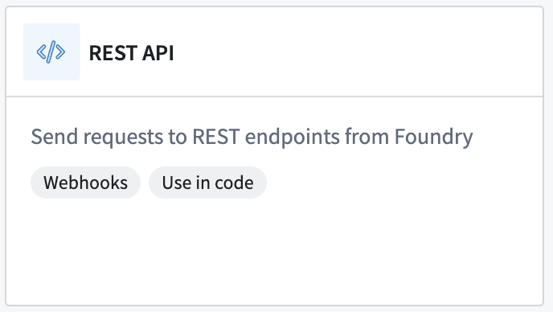
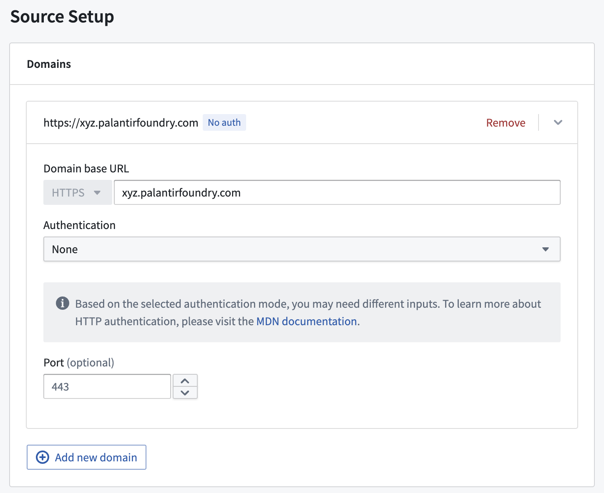
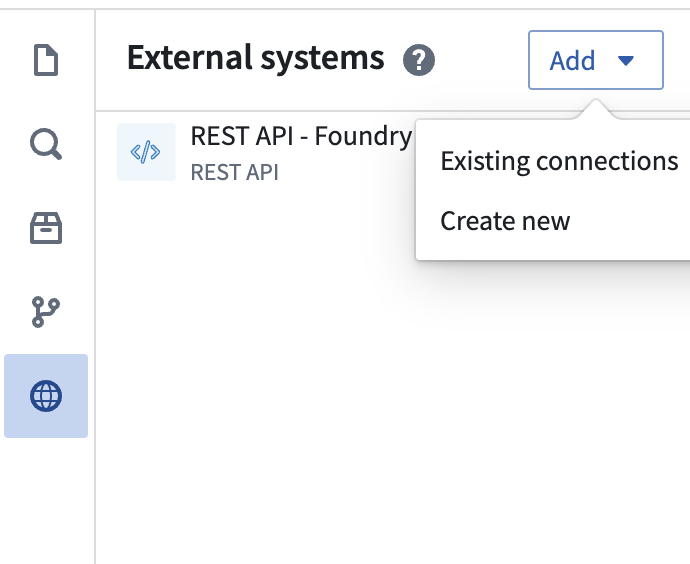
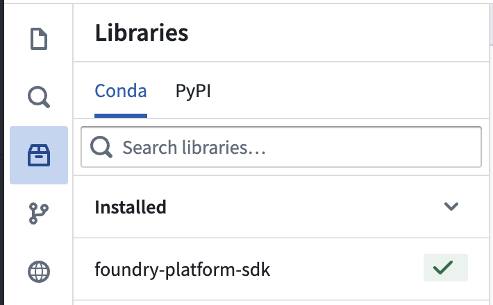
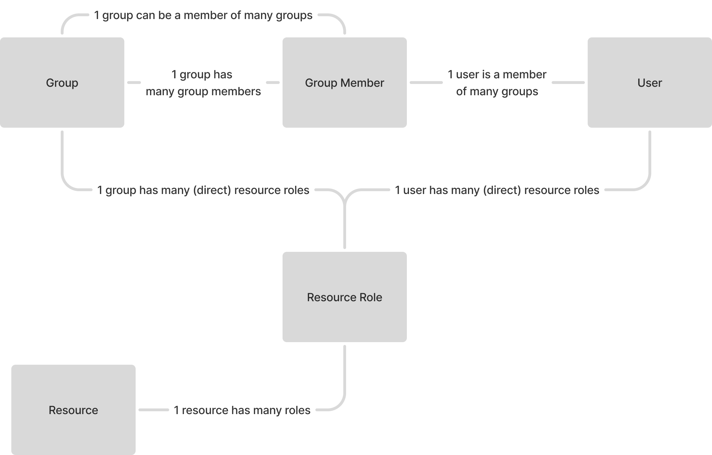

# Platform governance Application with Platform SDK

The platform governance application uses the Platform SDK to create a metadata governance app for stack administrators.  The application will show information about foundry users, groups, resources, and linter alerts all in one place.

The Foundry Platform Software Development Kit (SDK) is generated from the Foundry API specification file. The SDK encompasses endpoints related to interacting with the platform itself. The Platform SDK surfaces endpoints for interacting with foundry settings (users groups, markings), filesystems (projects and resources), datasets, object types, and much, much more.  In this example, we use the Platform SDK to run transformations in code repositories that pull Foundry metadata into datasets.

## Application Overview

#### Groups tab

By clicking into a group, you can see all child users, both direct and inherited. You can also see parent groups that have the selected group as a group member. In the resources section, you can see all resources that this group has permissions on (both direct and inherited via other groups) as well as the level of permissions.

#### Users tab

In the users view, you can see all groups the user is a part of, both direct and inherited. You can also see all resources the user has permissions on (both direct and inherited).

#### Resources tab

In the resources tab, you can click into a resource and see all users and groups that have access to the resource. Again, you can see both direct users and groups, along with inherited users and groups.

#### Linter alerts tab

Finally, in the linter alerts tab, you can see existing alerts. Alerts are a great way to ensure that your stack's resources, groups, and users are following hard-to-enforce rules and best practices.

#### Common application uses

An administrator will be able to use this application for several different forms of investigative workflows.  For example, if an admin wants to see users within a group, both direct and inherited, they can do that.  And inherited user is a user that is in a sub group of a group.  Another investigation could be to identify all inherited users (or groups) of a resource, or all inherited resources of a user (or group).  A final common investigation pattern is to filter to a specific resource or project type and confirm if a certain group has access.  For example, an admin might want to ensure that the datasource-manager group has access to all foundry datasources.

The linter rules tab allows for automated checks to run against my organizations best practices and rules. The platform governance app is only deployed with very basic alerts. For example, an alert is thrown if the resource principal type "Everyone" has editor or owner access to a project, which is considered bad practice in most cases, since the project can be edited or manipulated by anyone with stack access. Alerts can be easily added and configured later!

## Setup overview

Using the Platform SDK requires setting up OAuth application which will create a service user. The service user will show up as regular user, except with a client ID and secret. The service user will need to be put in a Foundry Group that has access to resources, users, and groups. We will store the service user in a REST source, and then use the rest source in our transforms repository to authenticate with Foundry. From there, we can build the transforms, and once the pipeline runs and the ontology hydrates, everything will be setup! Once everything is working feel free to add more linter alerts.

## Setup instructions

### 1. Upload Package to Your Enrollment

The first step is uploading your package to the Foundry Marketplace:

1. Download the project's `.zip` file from this repository
2. Access your enrollment's marketplace at:
   ```
   {enrollment-url}/workspace/marketplace
   ```
3. In the marketplace interface, initiate the upload process:
   - Select or create a store in your preferred project folder
   - Click the "Upload to Store" button
   - Select your downloaded `.zip` file


Before we can begin the installation process, we will need to setup our data connection source, which is a necessary input parameter.

### 2. Setting up the OAuth Application

First, navigate to the Developer Console to begin setting up the OAuth application.

- Developer Console can be found at: `{enrollment-url}/workspace/developer-console`

From there, click on "New Application".

Enter an application name. Something like "Platform governance OAuth app" should work.

Next, it will ask if you will be using the Ontology SDK. Say no, since we don't need to interact with ontology entities.

For the Organization section, select the organization that you want governance application for. Make sure to click the checkbox below to enable the application for your organization.

In the next step, for Application Type, select backend service. We only need this application for a service user, so we don't need a front end.

For Permissions, select Application permissions. This means we will be creating a service user, as opposed to using a real user's permissions to authenticate.

From there, we can move on to review and then click create application! This will setup the OAuth application.

### 3. Storing the client secret

Once you click create application, you will be prompted to store the client secret.  This is the password for the service user and should be stored somewhere private and secure (but accessible). 


If this password is lost, you will be able to generate a new password, but any places that use the existing password will need to be updated.

### 4. Managing Oauth application permissions

Once your app is created, you should see an OAuth and Permissions page, which allows you to manage your application.

At the very top of the page, you will see your client id. This is needed when authenticating with the service user. Speaking of service users, if you go into settings, you will now see your service user under the users section.

On this page, you can share your OAuth client with other groups and users. This is recommended if you don't want to be the only one managing your application.

You can also add additional organizations at the bottom in the Application discovery section.

### 5. Giving your service user appropriate permissions by adding it to a Foundry group

Now that your OAuth application setup is complete, you can navigate to settings to see your service user.


By default, your service user does not have permissions to see other users, groups, or resources.  Since the platform governance app collects Foundry information based on what the service user can see, you will need to permission the service user appropriately.

At this point, a stack admin will need to get involved to add the service user to a group with appropriate access. (Most likely an admin or high level group)

* Warning - the platform governance app will use this service users permissions to create an application that showcases resources, roles, and groups.  To avoid Foundry metadata from being exposed to people via the platform governance app who would not be able to see certain resources, users, and groups otherwise, this project should be locked down.
* The easiest fix to avoid this potential data leakage is to permission the project to only be viewed by the same people in the group that the service user is a part of.

### 6. Creating a REST source to store the service user's credentials

Once the service user has been added to the correct group, we can create a REST source to store the service user's credentials.

To do this, navigate to the Data connection app and click on New source.

- Data connections app can be found at: `{enrollment-url}/workspace/data-ingestion-app/sources`

The source we will be using here is the REST API source. (We can also use the generic source).


For Connection type, choose direct connection, since we don't need an agent to connect to Foundry.

Name your source something appropriate, such as "Foundry source via service user".

ou can put this source in the platform governance project, or you can create a new project to store this source, depending on your stack's best practices and standards.

In the connection details, we can add stack URL in the domain setup section.  We don't need to add a primary auth method.


For Additional secrets, we will need to create two. One for the client ID, and one for the client secret. This is where we need to recall the client ID and secret that the OAuth application gave us. Name the client id secret "ClientId", and name the secret "ClientSecret".

In Network Connectivity, for egress policies, we will need to add an egress policy for our stack. That policy will depend on what your stack's URL is, but should look like "xyz.palantirfoundry.com". If this policy does not exist, you can click "Request new policy".


Populate the domain with your stack's URL. The policy may need to be approved in control panel by an egress policy admin.

Once the policy is added, there is only one more step. Go to the Code import configuration section, and make sure to allow this source to be imported into code repositories. You will also need to give the source an API name so that it can be referenced in code repositories.

### 7. Install the Package

Once the source is setup, you'll need to install the package in your environment. For detailed instructions, see the [official Palantir documentation](https://www.palantir.com/docs/foundry/marketplace/install-product).

The installation process has four main stages:

1. **General Setup**
   - Configure package name
   - Select installation location

2. **Input Configuration**
   - Configure any required inputs.
   - This is where you will select the source that you created.
   - You will also need to select the schedule build cadence.  Hourly or daily is recommended.

3. **Content Review**
   - Review resources to be installed such as Developer Console, the Ontology, and Functions

4. **Validation**
   - System checks for any configuration errors
   - Resolve any flagged issues
   - Initiate installation

### 8. Confirm your source is added to the Platform SDK transforms repository

Now that your source is setup and the installation is complete, we can go ahead and make sure it is in our transforms repository.  To navigate to the transforms repository, you can click through to the installation overview, scroll down to the Repository section and find "platform governance transforms" there. The repository should be created automatically in a folder marked "logic".

First, we need to make sure our source is added to our transforms repository. On the left there is a panel marked External systems.  In there, we should see our source listed.  If it is not listed, we can add an existing connection.


### 9. Locate the foundry-platform-sdk package in the repository libraries panel

Once the source is added, we also need to make sure the foundry-platform-sdk Conda package is added.

In the libraries panel, search for and add foundry-platform-sdk.  If it is not installed, it will take a minute to install.


### 10. Go through all of the TODO comments in the code

Now that all of the dependencies are checked off, we can finally look at the code!

Start with the utils file.  This is where we create an authenticated client object that we will use in our other transforms.

Lets also make sure the client ID and secret are correct.

Once this is done, navigate to the users transform.  In here, we need to make sure the source in the external_systems decorator at the top references the correct source.

Make sure to do the same thing in the other files as well.

Finally, you can build all of the transforms! To do so, click on each transform (there are three) and click the build button in the top right corner.  While they are building, navigate back to the users tab to find a bonus todo item.

### 11. Understanding the datasets (and ontology)

The platform governance app deploys 5 datasets that are turned into ontology objects.  The model is as shown in this diagram:


A group has many group members.  A group member can either be a group or a user. A group and a user are combined into the term called a principal.

A resource is connected to groups and users via the resource roles dataset.  The resource roles dataset contains the group or user (principal) that has access to the resource, as well as the role that the principal has on that resource.  For example, the role may be owner, editor, viewer, or discoverer. Additionally, some resources may have a principal type of "Everyone", which represents all users.

### 12. Using the Platform Governance Application.

Now that the transforms are built, you should be able to see the finished product in the platform governance application!

If you aren't able to see any data, confirm that the transforms built correctly.  Also confirm that the ontology finished hydrating.

In the application, you can see users, groups, resources, and linter alerts in one place.  

By clicking into a group, you can see all child users, both direct and inherited.  You can also see parent groups that have the selected group as a group member. In the resources section, you can see all resources that this group has permissions on (both direct and inherited via other groups) as well as the level of permissions.  

In the users view, you can see all groups the user is a part of, both direct and inherited.  You can also see all resources the user has permissions on (both direct and inherited).

In the resources tab, you can click into a resource and see all users and groups that have access to the resource.  Again, you can see both direct users and groups, along with inherited users and groups. 

Finally, in the linter alerts tab, you can see existing alerts. Alerts are a great way to ensure that your stack's resources, groups, and users are following hard-to-enforce rules and best practices.

### 13. Moving beyond: configuring new alerts!

The platform governance app is only deployed with very basic alerts.  For example, an alert is thrown if the resource principal type "Everyone" has editor or owner access to a project, which is considered bad practice in most cases, since the project can be edited or manipulated by anyone with stack access.

The alerts are created in a pipeline builder application.  To create additional alerts, follow the existing schema and union your alerts into the alerts dataset from within the pipeline.

- Other common linter alerts entail making sure a group or user always have access to resources of a certain type.  For example, if your stack has a datasource admins group, you can setup an alert if that group does not have owner access to a resource of type "magritte source".

Another common way to create alerts is via the Foundry Rules application.  Use the Foundry rules application if you want to have a frontend workshop widget to allow users to easily standup their own rules.

- Foundry roles can be found at: `{enrollment-url}/workspace/foundry-rules`