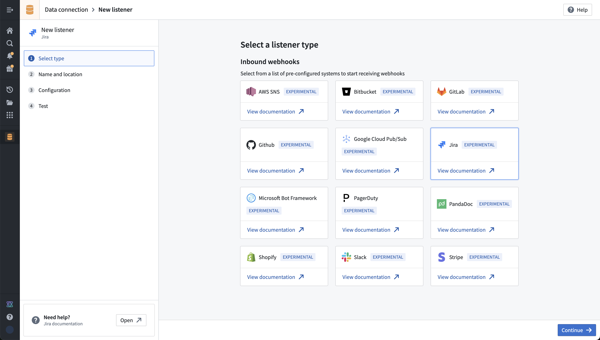
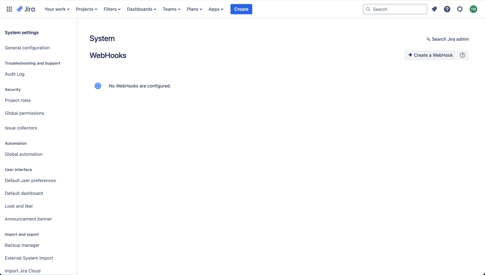
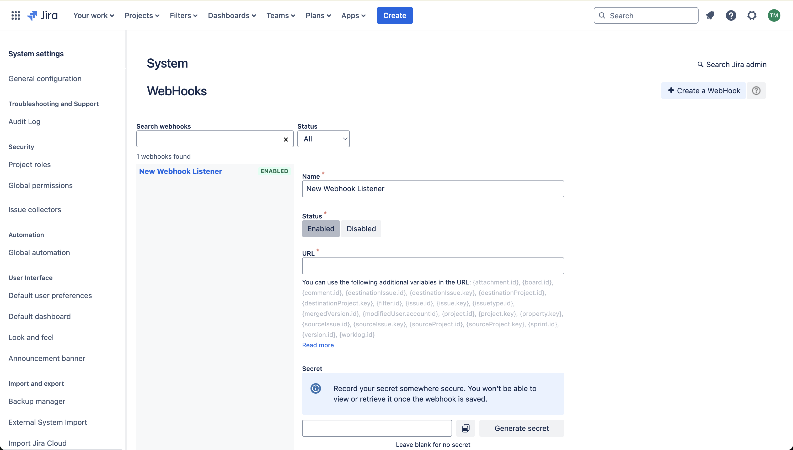
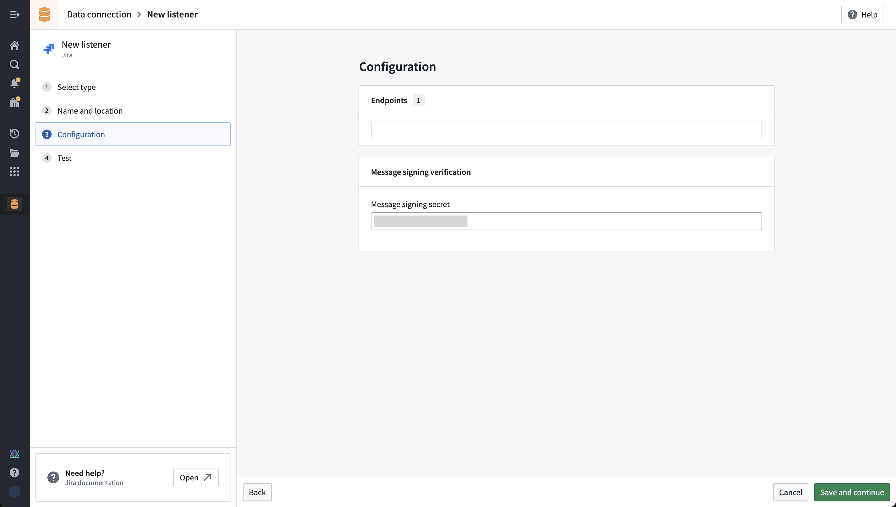
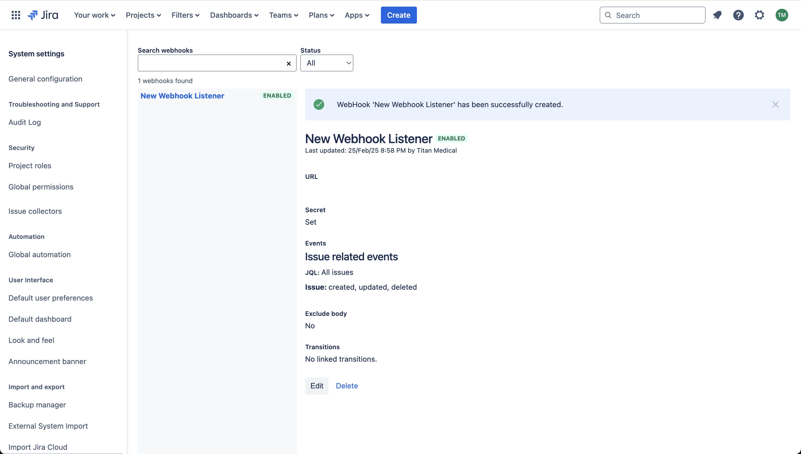
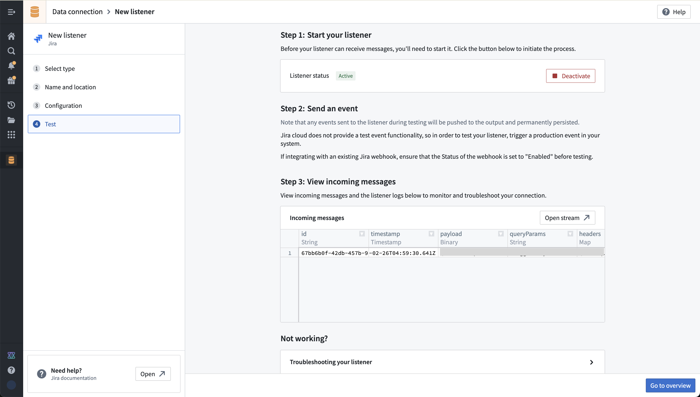
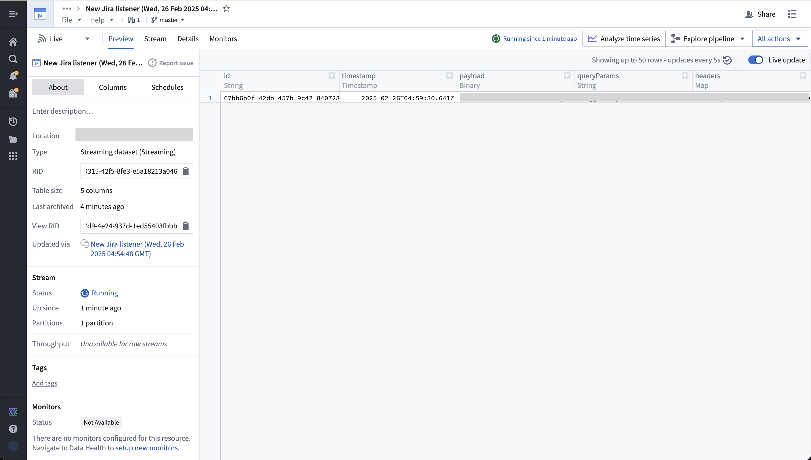

# Community Registry - Push-based events

## Purpose

With event listeners in data connection, it’s now possible to set up streaming feeds from a bunch of new systems. This is available in limited beta, and it can be tricky to figure out exactly how to set up the required configuration in the external systems that are currently supported. This registry cannot be installed, but instead is meant to explain and show step-by-step tutorials for systems that we’ve tried out in order to make it easy for someone to get started.

## Event listeners in data connection

Event listeners provide a mechanism for Foundry to listen to events produced by another system.

These external systems may not be able to use standard bearer token authentication, and are normally do not provide a configurable payload that can conform to what the standard Foundry API endpoints will accept.

To accept inbound events from these systems, data connection listeners provision a URL that can be provided, implement the specific message signing or other verification schemes for specific external systems, and allow a simple and low-latency mechanism to receive event-based data feeds into Foundry.

## How-to guide: Jira Cloud

This guide shows step-by-step how to configure a listener for Jira Cloud, to get a realtime feed of events from Jira to a Foundry streaming dataset.

Pre-requisite: you must have your own instance of Jira Cloud with administrator access in order to follow this how-to guide. More information about Jira cloud can be found here: https://developer.atlassian.com/cloud/jira/platform/

1. Create a WebHook in Jira.

   a. This can be done in the Jira admin panel under https://<your jira domain>/plugins/servlet/webhooks#
   b. More information about Jira webhooks can be found in their public documentation: https://support.atlassian.com/jira-cloud-administration/docs/manage-webhooks/

2. Create a Jira listener in Foundry

   a. This will generate the listener URL that you need to copy and paste into the Jira “URL” field when creating a WebHook
   b. You should also generate a message signing secret in Jira, and copy to the message signing secret in the Foundry listener configuration. You can also set up without a signing secret.
   c. Note that listeners may not be created in a personal folder, and must be created in a project.

3. Choose the set of Jira events that should be sent to your listener and then click “create”. In this example, I’m subscribing to issue created, updated, and deleted events:

4. Save the listener configuration in Foundry, and click “Activate” in the listener test screen to start your listener.

5. You may need to allow inbound traffic from the system that is pushing data to your Foundry instance. This can be done in control panel by an Information Security Officer for your Foundry enrollment. More information on managing ingress can be found here: https://www.palantir.com/docs/foundry/administration/configure-ingress
6. Make a change to trigger an event to your listener. You should see it appear in the incoming messages view in data connection, as well as in the underlying stream that the listener outputs to.

You can now use this streaming data in Foundry pipelines, to put data into the ontology, or monitor using Automate to trigger effects in real time.
