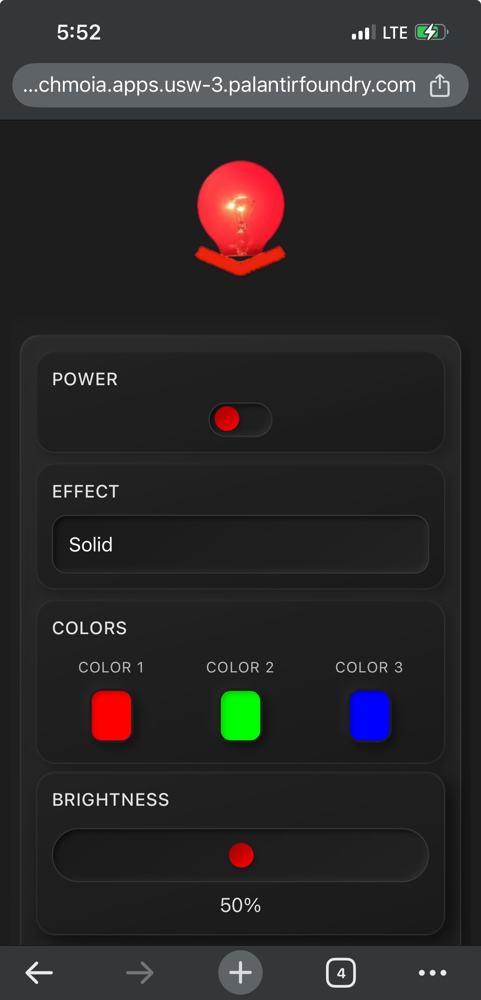
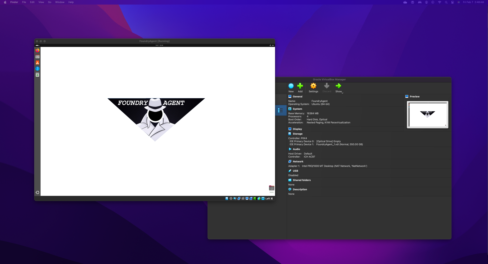

# WLED Controller and Agent Effect Scheduler

## Description
A sophisticated Palantir Foundry application that brings intelligent control to WLED-enabled LED devices through the power of AI and automation. This project combines WLED's versatile LED control capabilities with Palantir's Agent and AIP (Artificial Intelligence Platform) to create an automated, context-aware lighting system that responds to holidays.

Key Features:
- Automated holiday detection using AIP/LLMs
- Smart scheduling based on sunrise/sunset times
- Multi-device control and synchronization
- Custom React-based control interface
- Automated effect scheduling and management

## Requirements

### Hardware Requirements
- WLED-compatible LED controller (tested with QuinLED Dig2Go)
- Network-connected Linux environment for Foundry Agent
- LED strips compatible with WLED controller

### Software Requirements
- Palantir Foundry with Enterprise License (for compute module OSDK)
- WLED firmware installed on LED controller
- Network connectivity between Foundry Agent and WLED controller
- Linux-based Foundry Agent environment

## Installation Instructions

### 1. WLED Controller Setup
1. Install WLED firmware on your LED controller
2. Connect the controller to your network
3. Note down the controller's IP address for configuration

### 2. Foundry Agent Setup
1. Deploy a Linux-based Foundry Agent on your network
2. Ensure the agent has network access to the WLED controller
3. Configure necessary permissions and network rules

### 3. Application Configuration
1. Create a new webhook configuration in Foundry:
   - Define POST/GET endpoints for WLED control
   - Configure authentication if required
   - Set up response handling
2. Create Actions in Foundry:
   - Map webhook calls to actionable items
   - Configure input parameters for effect control
3. Deploy the React front-end application
4. Configure the compute module for automated scheduling

## Configuration

### Webhook Configuration
Configure webhooks to handle the following WLED API endpoints:
- GET /api/state - For retrieving current device state
- POST /api/state - For setting effects and parameters
- GET /api/effects - For retrieving available effects

### Action Setup
1. Create actions for:
   - Direct effect control
   - Holiday mode toggle
   - Scheduling operations
2. Map actions to corresponding webhooks
3. Configure action parameters and validation

### Automation Setup
1. Configure AIP integration:
   - Set up daily schedule checking
   - Configure holiday detection parameters
   - Define effect mappings for different holidays
2. Set up compute module scheduling:
   - Configure sunset/sunrise calculations
   - Define holiday effect parameters
   - Set up error handling and logging

## Usage

### Manual Control
Access the React-based control interface to:
- Manually trigger effects
- Override automated schedules
- Configure device parameters
- View device status and current effects

### Automated Operation
The system operates in two modes:

1. Holiday Mode:
   - System checks current date against LLM prompting for holiday and effect detail if applicable.
   - Automatically selects appropriate effects for recognized holidays
   - Activates at sunset and deactivates at sunrise
   - Uses AIP to determine appropriate effects based on holiday context

2. Standard Mode:
   - Maintains default settings or scheduled effects
   - Can be overridden by manual controls
   - Returns to automated schedule at next trigger point

### Monitoring and Management
- View system status through the dashboard
- Monitor automation logs
- Adjust schedules and effects through the interface
- Configure holiday detection parameters

## Screenshots/Demos

### Mobile Interface

### Holiday Effects Example - St. Patrick's Day

### System Components

## License
Copyright 2024 Palantir Technologies Inc.

Licensed under the Apache License, Version 2.0 (the "License");
you may not use this file except in compliance with the License.
You may obtain a copy of the License at

    http://www.apache.org/licenses/LICENSE-2.0

Unless required by applicable law or agreed to in writing, software
distributed under the License is distributed on an "AS IS" BASIS,
WITHOUT WARRANTIES OR CONDITIONS OF ANY KIND, either express or implied.
See the License for the specific language governing permissions and
limitations under the License.

## Contributing
Please read the [Contributing Guidelines](../CONTRIBUTING.md) for details on submitting pull requests.

## Support
For technical questions, please post in the [community forums](https://community.palantir.com).
For general inquiries, contact aip-community-registry@palantir.com.

## Troubleshooting
Common issues and solutions:
1. Connection Issues:
   - Verify network connectivity between Agent and WLED controller
   - Check firewall settings and network rules
   - Confirm WLED controller IP address is correct

2. Effect Scheduling:
   - Verify compute module is running
   - Check timezone settings
   - Confirm sunset/sunrise calculations for your location

3. Holiday Detection:
   - Review AIP logs for decision making
   - Verify holiday database is up to date
   - Check effect mapping configuration
